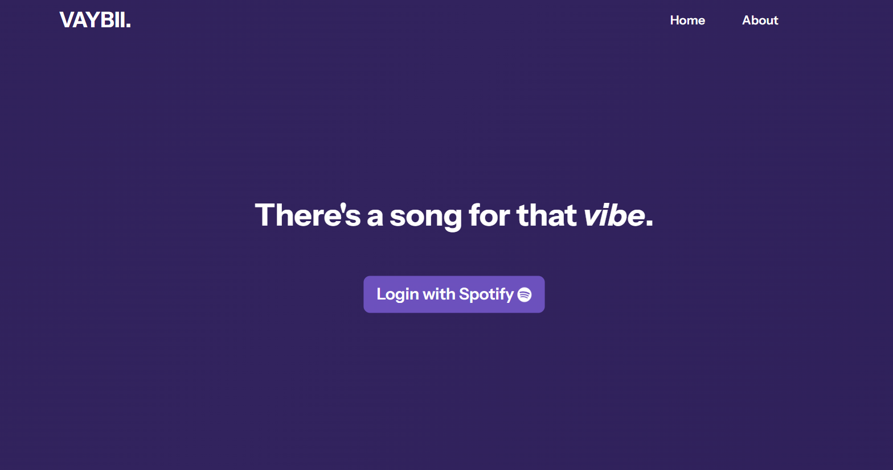

# 🎵 VAYBII
## A Spotify Mood-Based Song Recommendation App  

Turn your emotions into the perfect playlist! This app analyzes user input like *"I feel cozy at home while it’s raining outside"* to identify moods and match them to Spotify songs that resonate. Whether you're feeling nostalgic, energized, or relaxed, this app delivers personalized music recommendations tailored to your vibe.  

## 🚀 Purpose  
Vibin bridges the gap between emotion and music by delivering meaningful song suggestions. Typically when we search for songs, we already feel a certain type of way. We know what genres or artists to look for to satisfy that "vibe". Some would say we get into "main character energy" and by listening to music that matches our mood, we feel like the main character in a movie.

Designed to explore API integrations, sentiment analysis, and scalable application design, this project is both a creative experiment and a technical showcase.  

---

## 🛠️ Tech Stack  
- **Backend**: Spring Boot for RESTful API development and business logic.  
- **Frontend**: React and Bootstrap for a responsive and dynamic user interface.  
- **Database**: PostgreSQL via Supabase for managing users, emotions, moods, and genres.  
- **APIs**:  
  - **Hugging Face**: Emotion detection and sentiment analysis.  
  - **Spotify API**: Song search and playlist generation.  
